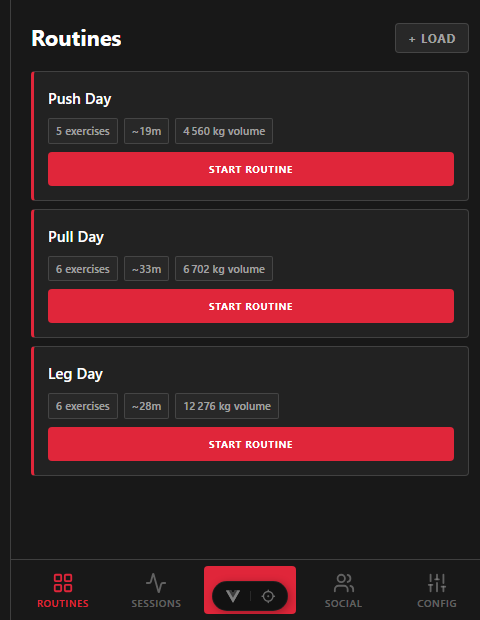
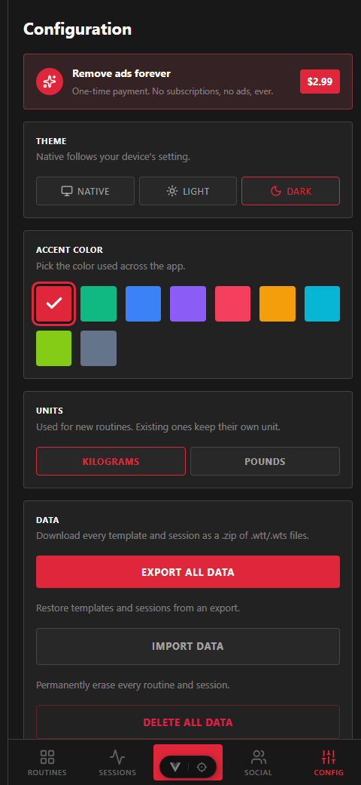
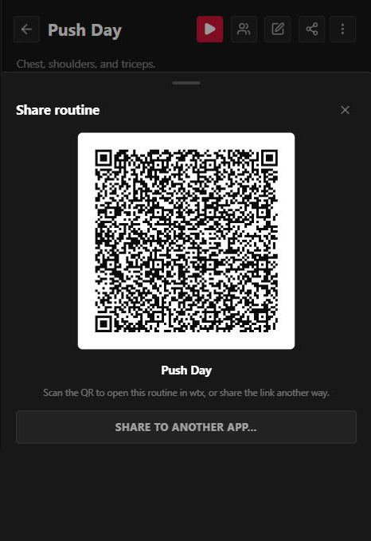

<div align="center">
  

  # wtx

  A mobile-first web client for **wtx**, a plain-text workout format.

  [](./LICENSE)
  [](https://vuejs.org/)
  [](https://www.typescriptlang.org/)
  [](https://vite.dev/)
</div>

Keep your training routines as small, human-readable `.wtt` files, then load,
build, and share them from your phone.

Everything lives in the browser: routines are stored in `localStorage`, and
sharing is done with self-contained links and QR codes that carry the whole
routine in the URL.

## Contents

- [Screenshots](#screenshots)
- [Features](#features)
- [The `.wtt` format](#the-wtt-format)
- [Tech stack](#tech-stack)
- [Getting started](#getting-started)
- [Project structure](#project-structure)
- [The wtx parser](#the-wtx-parser)
- [Deployment](#deployment)
- [License](#license)

## Screenshots

<table>
  <tr>
    <td align="center" width="33%">
      <br>
      <sub>Routines library</sub>
    </td>
    <td align="center" width="33%">
      <br>
      <sub>Configuration</sub>
    </td>
    <td align="center" width="33%">
      <br>
      <sub>Share via QR</sub>
    </td>
  </tr>
</table>

## Features

- **Templates library** — every `.wtt` routine you've added, parsed into a
  readable summary (exercise count, total sets, muscle groups).
- **Load a routine** three ways:
  - paste `.wtt` text,
  - pick a `.wtt` file,
  - scan a QR code with the camera, or from an image.
- **Create a routine** with a form that serializes back to valid `.wtt` text.
- **Share via QR** — generates an import link (`/import?r=…`, the routine
  base64url-encoded into the query) and renders it as a QR code. Scanning it on
  another device opens the app with the routine ready to add.
- **Configurable accent color**, remembered across visits.

> The **Sessions** and **Friends** tabs are UI placeholders for now — logging
> workouts (`.wts` files) and social features aren't wired up yet, though the
> vendored parser already understands the session format.

## The `.wtt` format

A template is a name line, optional `key: value` metadata, and one exercise per
line:

```
# Push Day
unit: kg
tags: strength, upper

Bench Press    | reps 4x8   | 60 | rest 1m30s | muscle Chest
Overhead Press | reps 3x10  | 30 | rest 1m
Plank          | time 1m30s
```

- `# Name` — required, the first line.
- Metadata: `unit`, `description`, `notes`, `tags` (comma-separated).
- Exercise line: `Name | <reps NxM | time DURATION> | [weight] | [rest DURATION] | [muscle Group]`.
- Durations are compact: `1m30s`, `2m`, `45s`, `1h`.

Parsing is handled by a vendored copy of the reference parser — see
[The wtx parser](#the-wtx-parser).

## Tech stack

- [Vue 3](https://vuejs.org/) (`<script setup>`) + TypeScript
- [Vite](https://vite.dev/) for dev/build, [Vitest](https://vitest.dev/) for tests
- [Pinia](https://pinia.vuejs.org/) for state, [Vue Router](https://router.vuejs.org/) for navigation
- [`qr-scanner`](https://github.com/nimiq/qr-scanner) for reading QR codes,
  [`uqr`](https://github.com/unjs/uqr) for generating them
- [`@lucide/vue`](https://lucide.dev/) icons
- Local state in `localStorage`

## Getting started

**Prerequisites:** Node `^22.18.0 || >=24.12.0` and [pnpm](https://pnpm.io/).

```sh
pnpm install
pnpm dev          # start the dev server
```

### Scripts

| Command             | What it does                                              |
| ------------------- | -------------------------------------------------------- |
| `pnpm dev`          | Vite dev server with HMR                                  |
| `pnpm build`        | Type-check (`vue-tsc`) then production build to `dist/`   |
| `pnpm build-only`   | Production build without the type-check step             |
| `pnpm preview`      | Serve the built `dist/` locally                           |
| `pnpm test:unit`    | Run the Vitest suite                                      |
| `pnpm lint`         | oxlint + ESLint, with `--fix`                             |
| `pnpm format`       | Prettier over `src/`                                      |
| `pnpm sync:wtx`     | Re-vendor the wtx parser from upstream                    |

### Accounts, sync and group workouts (Supabase)

The app works fully on-device without an account. Creating one (Social tab)
syncs routines and sessions to [Supabase](https://supabase.com/) and unlocks
group workouts. To enable it:

1. Create a Supabase project. In **Authentication → Providers**, enable Email
   (turn off "Confirm email" for quick testing).
2. Apply the schema. Each table lives in its own file under
   `supabase/tables/` (applied in file-name order); `pnpm db:migration`
   bundles them into `supabase/migrations/`. Either paste that migration into
   the SQL editor, or use the CLI:
   ```sh
   npx supabase init        # once; keeps the existing migrations
   npx supabase link --project-ref <ref>
   npx supabase db push
   ```
3. Deploy the account-deletion function with the project's secret key
   (`sb_secret_…`, never shipped in the app):
   ```sh
   npx supabase secrets set SERVICE_KEY=sb_secret_...
   npx supabase functions deploy delete-account
   ```
4. Copy `.env.example` to `.env.local` and set `VITE_SUPABASE_URL` (the bare
   `https://<ref>.supabase.co`) and `VITE_SUPABASE_ANON_KEY` (the publishable
   key, `sb_publishable_…`) from Project Settings → API Keys.

Without those variables the Social tab says accounts aren't set up, and
everything else keeps working locally.

## Project structure

```
src/
  components/       UI: tab bar, bottom sheets, routine/exercise views
    load/           "Load a routine" sheet (paste / file / QR)
    wtx/            "Create a routine" form and the WTX action menu
    share/          "Share via QR" sheet
  views/            Routed pages (templates, import, sessions, friends, config)
  stores/           Pinia stores (routines, theme, UI sheet state)
  lib/
    wtx/            Vendored wtx parser (see below)
    parseRoutine.ts non-throwing wrapper around the parser
    share.ts        link encode/decode + QR payload parsing
    serializeRoutine.ts   RoutineDraft -> .wtt text
  config/theme.ts   accent color palette
scripts/
  sync-wtx.mjs      pulls the parser from jcrucesdeveloper/wtx
```

## The wtx parser

`src/lib/wtx/` is a vendored, line-for-line port of the TypeScript parser from
[`jcrucesdeveloper/wtx`](https://github.com/jcrucesdeveloper/wtx) (MIT). Only
mechanical changes are applied (import extensions, quote style, a couple of
index assertions for `noUncheckedIndexedAccess`) — no parsing logic is touched.

To update it, bump the ref and run:

```sh
pnpm sync:wtx        # or: node scripts/sync-wtx.mjs <ref>
pnpm format
```

Then review the diff and update the "Upstream commit" line in
`src/lib/wtx/README.md`.

## Deployment

Deployed on Cloudflare as a static-assets app. It's a single-page app, so the
host serves `index.html` for unknown routes
(`not_found_handling: "single-page-application"`). Pushes to `main` build and
deploy automatically:

```sh
pnpm build          # -> dist/
```

## License

**All rights reserved.** This project is source-available for reference only —
you may not copy, reuse, modify, or redistribute the code without permission.
See [`LICENSE`](./LICENSE).

The one exception is the vendored parser in `src/lib/wtx/`, which is MIT-licensed
by its upstream author ([`jcrucesdeveloper/wtx`](https://github.com/jcrucesdeveloper/wtx))
and carries its own terms.
