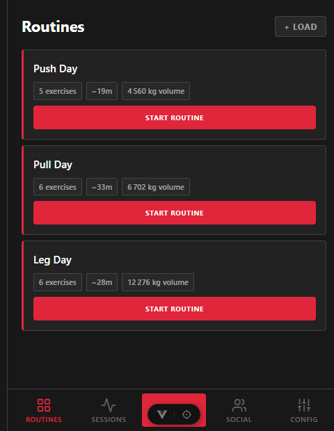
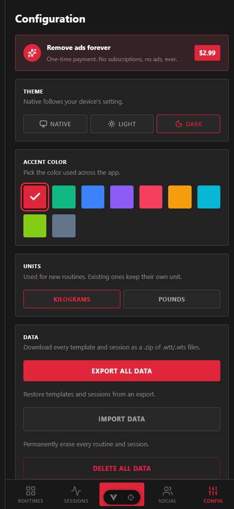
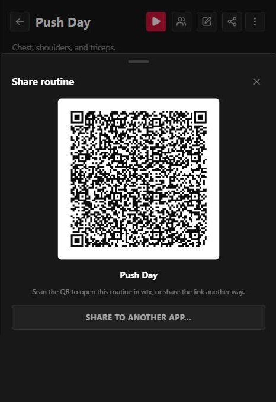

<div align="center">
  

  # wtx

  A mobile-first web client for **wtx**, a plain-text workout format.

  [](./LICENSE)
  [](https://vuejs.org/)
  [](https://www.typescriptlang.org/)
  [](https://vite.dev/)
</div>

Keep your training routines as small, human-readable `.wtt` files, then load,
build, and share them from your phone.

Everything lives in the browser: routines are stored in `localStorage`, and
sharing is done with self-contained links and QR codes that carry the whole
routine in the URL.

## Contents

- [Screenshots](#screenshots)
- [Features](#features)
- [The `.wtt` format](#the-wtt-format)
- [Tech stack](#tech-stack)
- [Getting started](#getting-started)
- [Project structure](#project-structure)
- [The wtx parser](#the-wtx-parser)
- [Store release checklist](#store-release-checklist)
- [Deployment](#deployment)
- [License](#license)

## Screenshots

<table>
  <tr>
    <td align="center" width="33%">
      <br>
      <sub>Routines library</sub>
    </td>
    <td align="center" width="33%">
      <br>
      <sub>Configuration</sub>
    </td>
    <td align="center" width="33%">
      <br>
      <sub>Share via QR</sub>
    </td>
  </tr>
</table>

## Features

- **Templates library** — every `.wtt` routine you've added, parsed into a
  readable summary (exercise count, total sets, muscle groups).
- **Load a routine** three ways:
  - paste `.wtt` text,
  - pick a `.wtt` file,
  - scan a QR code with the camera, or from an image.
- **Create a routine** with a form that serializes back to valid `.wtt` text.
- **Share via QR** — generates an import link (`/import?r=…`, the routine
  base64url-encoded into the query) and renders it as a QR code. Scanning it on
  another device opens the app with the routine ready to add.
- **Configurable accent color**, remembered across visits.
- **Sessions** — log a workout against a routine, with a rest timer, live PR
  detection, a review step before finishing, and a training calendar.
- **Social** (optional, see below) — sync your library across devices and
  train live with friends in a group-workout room: shared countdown, live
  progress, cheers, and a recap once everyone's done.

## The `.wtt` format

A template is a name line, optional `key: value` metadata, and one exercise per
line:

```
# Push Day
unit: kg
tags: strength, upper

Bench Press    | reps 4x8   | 60 | rest 1m30s | muscle Chest
Overhead Press | reps 3x10  | 30 | rest 1m
Plank          | time 1m30s
```

- `# Name` — required, the first line.
- Metadata: `unit`, `description`, `notes`, `tags` (comma-separated).
- Exercise line: `Name | <reps NxM | time DURATION> | [weight] | [rest DURATION] | [muscle Group]`.
- Durations are compact: `1m30s`, `2m`, `45s`, `1h`.

Parsing is handled by a vendored copy of the reference parser — see
[The wtx parser](#the-wtx-parser).

## Tech stack

- [Vue 3](https://vuejs.org/) (`<script setup>`) + TypeScript
- [Vite](https://vite.dev/) for dev/build, [Vitest](https://vitest.dev/) for tests
- [Pinia](https://pinia.vuejs.org/) for state, [Vue Router](https://router.vuejs.org/) for navigation
- [`qr-scanner`](https://github.com/nimiq/qr-scanner) for reading QR codes,
  [`uqr`](https://github.com/unjs/uqr) for generating them
- [`@lucide/vue`](https://lucide.dev/) icons
- Local state in `localStorage`

## Getting started

**Prerequisites:** Node `^22.18.0 || >=24.12.0` and [pnpm](https://pnpm.io/).

```sh
pnpm install
pnpm dev          # start the dev server
```

### Scripts

| Command             | What it does                                              |
| ------------------- | -------------------------------------------------------- |
| `pnpm dev`          | Vite dev server with HMR                                  |
| `pnpm build`        | Type-check (`vue-tsc`) then production build to `dist/`   |
| `pnpm build-only`   | Production build without the type-check step             |
| `pnpm preview`      | Serve the built `dist/` locally                           |
| `pnpm test:unit`    | Run the Vitest suite                                      |
| `pnpm lint`         | oxlint + ESLint, with `--fix`                             |
| `pnpm format`       | Prettier over `src/`                                      |
| `pnpm sync:wtx`     | Re-vendor the wtx parser from upstream                    |

### Accounts, sync and group workouts (Supabase)

The app works fully on-device without an account. Creating one (Social tab)
syncs routines and sessions to [Supabase](https://supabase.com/) and unlocks
group workouts. To enable it:

1. Create a Supabase project. In **Authentication → Providers**, enable Email
   (turn off "Confirm email" for quick testing).
2. Apply the schema. `supabase/migrations/` holds the standard, hand-written
   Supabase CLI migrations. Either paste `20260925000000_accounts_sync_rooms.sql`
   into the SQL editor, or use the CLI:
   ```sh
   npx supabase init        # once; keeps the existing migrations
   npx supabase link --project-ref <ref>
   npx supabase db push
   ```
   For future schema changes, scaffold a new timestamped file with
   `npx supabase migration new <description>`, write the SQL by hand, commit
   it, then `npx supabase db push` again. Never edit a migration that's
   already been applied — add a new one instead.
3. Deploy the account-deletion function with the project's secret key
   (`sb_secret_…`, never shipped in the app):
   ```sh
   npx supabase secrets set SERVICE_KEY=sb_secret_...
   npx supabase functions deploy delete-account
   ```
4. Copy `.env.example` to `.env.local` and set `VITE_SUPABASE_URL` (the bare
   `https://<ref>.supabase.co`) and `VITE_SUPABASE_ANON_KEY` (the publishable
   key, `sb_publishable_…`) from Project Settings → API Keys.

Without those variables the Social tab says accounts aren't set up, and
everything else keeps working locally.

### Moderation

The social feed is user-generated content, so the app ships the tools App
Store guideline 1.2 and Google Play's UGC policy ask for
(`supabase/migrations/20260930000000_moderation.sql`):

- **Report** — the ⋯ menu on someone's profile (Report account) or on a
  shared workout (Report post) files a row in `content_reports` with a reason
  and optional details. The app can only insert; reading and resolving
  happens in the dashboard.
- **Block** — the same ⋯ menus. Blocking removes the follows between both
  people, hides each other's profiles and workouts, and stops any follow
  path (code, "Follow back", finishing a room together). The other person
  isn't notified. Your blocked list is under your own profile → ⋯ → Blocked
  accounts.
- **Word filter** — `public.contains_blocked_terms()` (mirrored in
  `src/lib/contentFilter.ts`, keep them in sync) rejects a short list of
  slurs and explicit terms in display names and bios, and the app won't
  share a workout to the feed whose name, notes or exercise names contain
  one.

**Review reports within 24 hours** (that's the promise the app makes to
reporters). In the Supabase dashboard, open **Table Editor → content_reports**
filtered to `status = open`, or run in the SQL editor:

```sql
select r.created_at, r.reason, r.details,
       reporter.display_name as reporter, reported.display_name as reported,
       r.reported_user_id, r.session_id, s.raw_text
from content_reports r
left join profiles reporter on reporter.id = r.reporter_id
left join profiles reported on reported.id = r.reported_user_id
left join sessions s on s.id = r.session_id
where r.status = 'open'
order by r.created_at;
```

Then act and close the report:

```sql
-- Take a workout off the feed (it stays in its owner's history).
update sessions set shared = false, feed_snapshot = null where id = '<session_id>';

-- Clear an offensive name or bio.
update profiles set display_name = 'Athlete', bio = '' where id = '<user_id>';

-- Ban: delete the account. Cascades to their profile, sessions, follows and
-- kudos; reports about them are kept with reported_user_id set to null.
-- (They could sign up again with a new email.)
delete from auth.users where id = '<user_id>';

-- Close the report: 'actioned' or 'dismissed'.
update content_reports set status = 'actioned' where id = '<report_id>';
```

The dashboard doesn't alert you to new reports. For an email per report, add
a Database Webhook on `content_reports` inserts that calls an Edge Function
which sends the email — not built yet.

### Crash reporting and analytics

Both are optional and off by default.

- **Crash reporting** is [Sentry](https://sentry.io/) (`src/services/crashReporting.ts`).
  Set `VITE_SENTRY_DSN` (Settings → Client Keys in your Sentry project) to
  enable it.
- **Analytics** goes through a small provider interface
  (`src/services/analytics.ts`) so the backend can be swapped later without
  touching call sites. The default provider (`src/services/supabaseAnalytics.ts`)
  writes to an `app_events` table on the same Supabase project used for sync —
  no new vendor needed. It only starts once Supabase is configured (see
  above), and only ever inserts an event name, platform, and app version;
  nothing identifying and nothing readable back through the client API.

### Reminders

On-device, opt-in local notifications (Configuration → Reminders) —
`src/services/notifications.ts`. A single rolling reminder that fires around
6pm local time only if nothing's been logged that day, mentioning the streak
by name once there's one worth protecting. Purely client-side, no server:
requires the app to have run `pnpm cap:sync` at least once so the native
projects pick up `@capacitor/local-notifications`.

This does not cover push notifications (e.g. "a friend invited you to a
room") — those need a friend to reach a device the app isn't currently open
on, which needs real push infrastructure (Firebase Cloud Messaging /
Apple Push Notification service, both requiring their own accounts and
native setup), not just this plugin.

## Project structure

```
src/
  components/       UI: tab bar, bottom sheets, routine/exercise views
    load/           "Load a routine" sheet (paste / file / QR)
    wtx/            "Create a routine" form and the WTX action menu
    share/          "Share via QR" sheet
  views/            Routed pages (templates, import, sessions, friends, config)
  stores/           Pinia stores (routines, theme, UI sheet state)
  lib/
    wtx/            Vendored wtx parser (see below)
    parseRoutine.ts non-throwing wrapper around the parser
    share.ts        link encode/decode + QR payload parsing
    serializeRoutine.ts   RoutineDraft -> .wtt text
  config/theme.ts   accent color palette
scripts/
  sync-wtx.mjs      pulls the parser from jcrucesdeveloper/wtx
```

## The wtx parser

`src/lib/wtx/` is a vendored, line-for-line port of the TypeScript parser from
[`jcrucesdeveloper/wtx`](https://github.com/jcrucesdeveloper/wtx) (MIT). Only
mechanical changes are applied (import extensions, quote style, a couple of
index assertions for `noUncheckedIndexedAccess`) — no parsing logic is touched.

To update it, bump the ref and run:

```sh
pnpm sync:wtx        # or: node scripts/sync-wtx.mjs <ref>
pnpm format
```

Then review the diff and update the "Upstream commit" line in
`src/lib/wtx/README.md`.

## Store release checklist

One-time steps before a build is submitted to the App Store / Play Store —
everything here needs a real AdMob account, so it can't be done from the repo
alone:

Every AdMob value defaults to Google's public test/sample IDs, so an
unconfigured (dev) build can never serve real ads. For a store build:

1. Create the apps and an interstitial ad unit per platform in the
   [AdMob console](https://apps.admob.com/).
2. Set the native **App IDs** (`ca-app-pub-XXXX~YYYY`) — build-time values,
   not Vite env vars:
   - Android: Gradle property `admobAppId`, e.g. in `~/.gradle/gradle.properties`
     (`admobAppId=ca-app-pub-...~...`), or `-PadmobAppId=...` on the command
     line, or the `ADMOB_APP_ID_ANDROID` env var. Injected into
     `AndroidManifest.xml` via `manifestPlaceholders` in `android/app/build.gradle`.
   - iOS: the `ADMOB_APP_ID` build setting of the App target (Xcode → App →
     Build Settings → User-Defined → `ADMOB_APP_ID`, Release), or
     `xcodebuild ... ADMOB_APP_ID=ca-app-pub-...~...`. `Info.plist` reads it as
     `$(ADMOB_APP_ID)`.
3. Set the **ad unit IDs** `VITE_ADMOB_INTERSTITIAL_ID_ANDROID` / `_IOS` and
   `VITE_ADMOB_TESTING=false` for the production build (e.g. in a gitignored
   `.env.production.local` or CI secrets — see `.env.example`). With
   `VITE_ADMOB_TESTING` unset, every request uses Google's test ad unit even
   when real IDs are set.
4. Sync with test mode off: `pnpm build && ADMOB_TESTING=false npx cap sync`
   (`capacitor.config.ts` reads the plain `ADMOB_TESTING` env var). Only do
   this for the release build — clicking real ads on your own test builds
   violates AdMob policy.
5. Host `app-ads.txt` at the root of the developer website listed in App Store
   Connect / Play Console (use the template in the repo, filled in with your
   AdMob publisher ID), then verify it in the AdMob console.
6. In AdMob → Privacy & messaging, publish a GDPR (and, optionally, US state
   regulations and IDFA explainer) message — the app runs Google's UMP consent
   flow before iOS App Tracking Transparency and before loading any ad.
7. iOS privacy: `ios/App/App/PrivacyInfo.xcprivacy` declares the app's data
   collection and tracking; keep it and the App Store Connect "App Privacy"
   answers in sync with it (plus what Google's SDK reports in the Xcode
   privacy report).
8. The in-app "Remove ads" purchase is hidden (`REMOVE_ADS_PURCHASE_ENABLED`
   in `ConfigurationView.vue`) until a real In-App Purchase flow exists.

## Deployment

Deployed on Cloudflare as a static-assets app. It's a single-page app, so the
host serves `index.html` for unknown routes
(`not_found_handling: "single-page-application"`). Pushes to `main` build and
deploy automatically:

```sh
pnpm build          # -> dist/
```

## License

**All rights reserved.** This project is source-available for reference only —
you may not copy, reuse, modify, or redistribute the code without permission.
See [`LICENSE`](./LICENSE).

The one exception is the vendored parser in `src/lib/wtx/`, which is MIT-licensed
by its upstream author ([`jcrucesdeveloper/wtx`](https://github.com/jcrucesdeveloper/wtx))
and carries its own terms.
